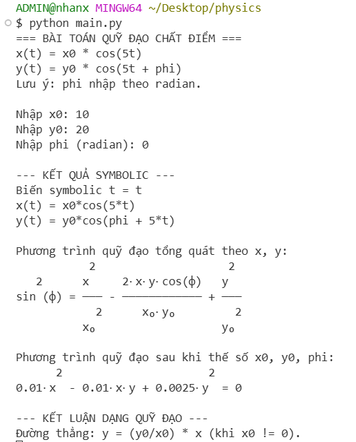
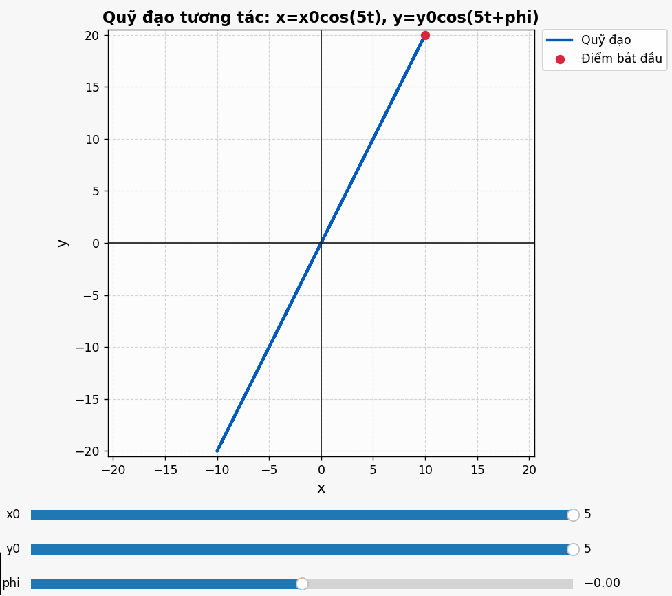
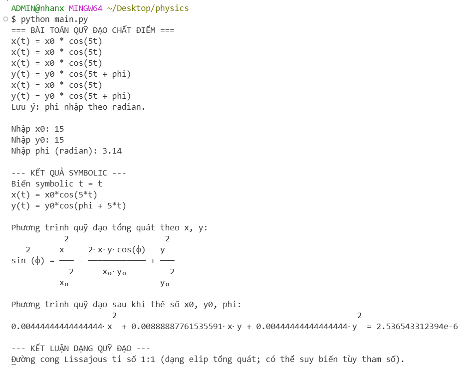
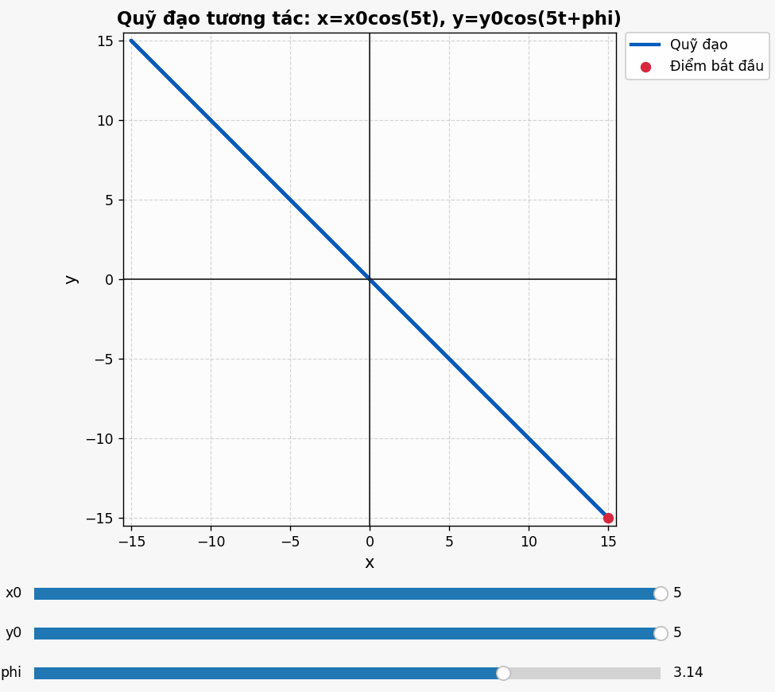
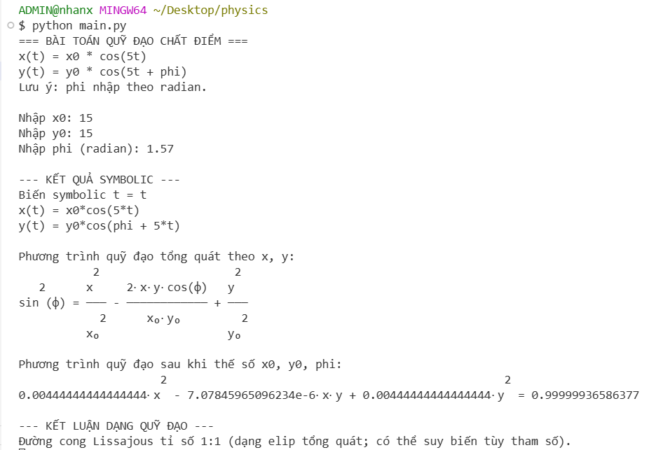
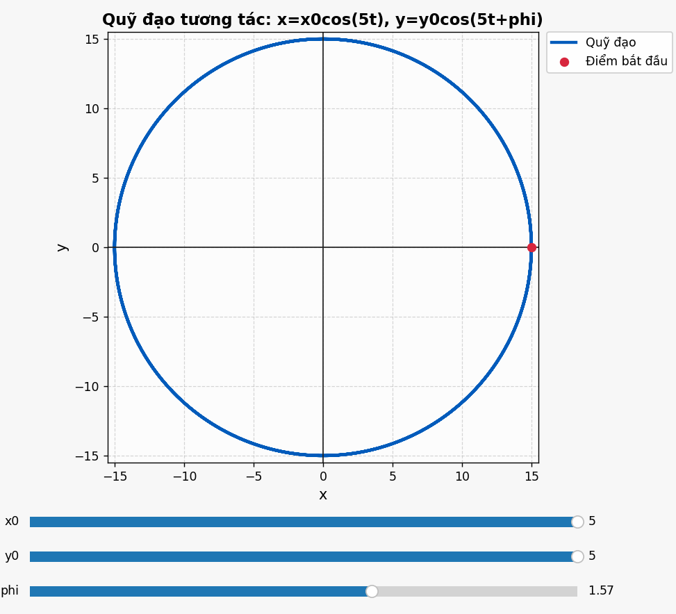
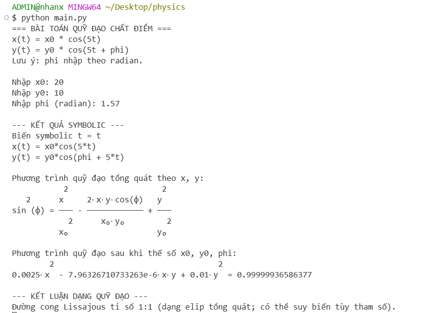
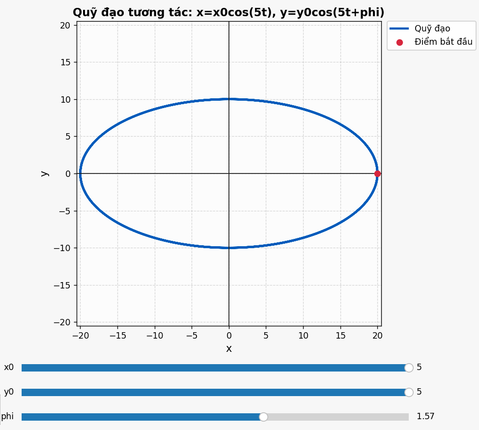
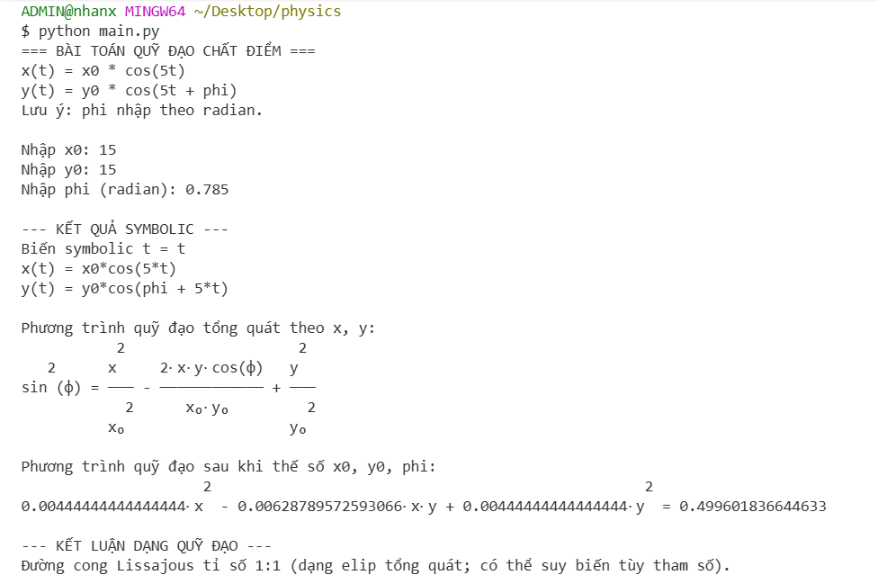
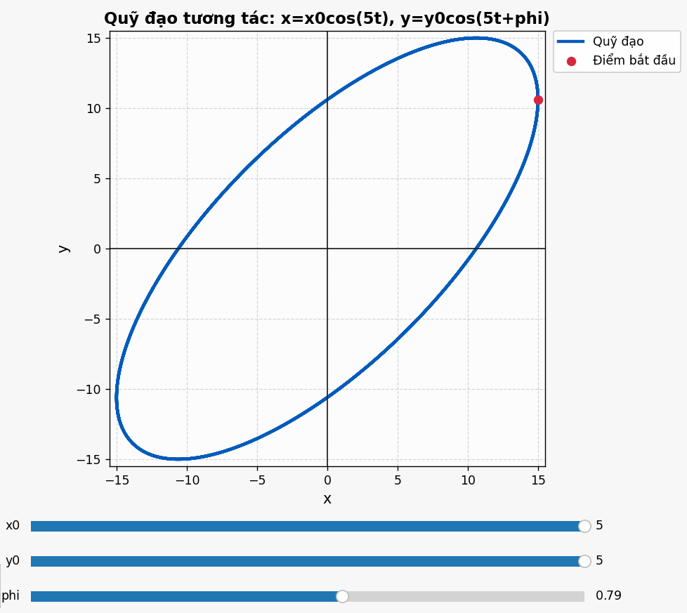

# BÁO CÁO BÀI TẬP LỚN

## Khảo sát quỹ đạo chất điểm với phương trình tham số

\[
\begin{cases}
x(t)=x_0\cos(5t),\\
y(t)=y_0\cos(5t+\varphi)
\end{cases}
\]

---

## 1. Mô hình toán học

### 1.1. Phương trình tham số của chuyển động

Xét chất điểm chuyển động trong mặt phẳng \(Oxy\) với:

\[
x(t)=x_0\cos(5t), \qquad y(t)=y_0\cos(5t+\varphi)
\]

Trong đó:

- \(x_0, y_0\): biên độ dao động theo hai trục \(x\), \(y\);
- \(\varphi\): độ lệch pha giữa hai dao động;
- tần số góc chung là \(\omega=5\) (rad/s).

Đặt \(u=5t\), ta có:
\[
X=\frac{x}{x_0}=\cos u, \qquad Y=\frac{y}{y_0}=\cos(u+\varphi)
\]

### 1.2. Biến đổi bằng công thức \(\cos(a+b)\)

Sử dụng công thức lượng giác:
\[
\cos(u+\varphi)=\cos u\cos\varphi-\sin u\sin\varphi
\]

Suy ra:
\[
Y=X\cos\varphi-\sin u\sin\varphi
\]

Chuyển vế:
\[
Y-X\cos\varphi=-\sin u\sin\varphi
\]

Bình phương hai vế:
\[
\left(Y-X\cos\varphi\right)^2=\sin^2u\,\sin^2\varphi
\]

Do \(\sin^2u=1-\cos^2u=1-X^2\), ta được:
\[
\left(Y-X\cos\varphi\right)^2=\sin^2\varphi\,(1-X^2)
\]

Khai triển và rút gọn:
\[
X^2-2\cos\varphi\,XY+Y^2=\sin^2\varphi
\]

Thế lại \(X=x/x_0\), \(Y=y/y_0\):
\[
\boxed{\frac{x^2}{x_0^2}-2\cos\varphi\,\frac{xy}{x_0y_0}+\frac{y^2}{y_0^2}=\sin^2\varphi}
\]

Đây là phương trình quỹ đạo không tham số (với \(x_0y_0\neq0\)).

### 1.3. Mối liên hệ giữa \(x\) và \(y\), bản chất quỹ đạo

Phương trình trên là một đường bậc hai trong mặt phẳng \((x,y)\), dạng tổng quát của **elip quay trục** (hoặc suy biến tùy tham số). Vì hai dao động có cùng tần số \(\omega=5\), quỹ đạo lặp lại theo chu kỳ hữu hạn:
\[
T=\frac{2\pi}{5}
\]
Do đó quỹ đạo là đường **kín**.

Về mặt cơ học và dao động điều hòa, đây chính là trường hợp đặc trưng của **đường Lissajous** với tỉ số tần số \(1:1\).

### 1.4. Phân tích các trường hợp đặc biệt

#### (a) \(\varphi=0\)

Khi \(\varphi=0\):
\[
y(t)=y_0\cos(5t)=\frac{y_0}{x_0}x(t)
\]
Nên quỹ đạo là đường thẳng đi qua gốc tọa độ:
\[
y=\frac{y_0}{x_0}x
\]

Nếu \(\varphi=\pi\), tương tự thu được đường thẳng có hệ số góc âm:
\[
y=-\frac{y_0}{x_0}x
\]

#### (b) \(\varphi=\frac{\pi}{2}\)

Khi đó \(\cos\varphi=0\), \(\sin^2\varphi=1\), phương trình quỹ đạo thành:
\[
\frac{x^2}{x_0^2}+\frac{y^2}{y_0^2}=1
\]
Đây là elip có trục song song trục tọa độ (đặc biệt là đường tròn nếu \(|x_0|=|y_0|\)).

#### (c) \(\varphi\) bất kỳ

Với \(\varphi\notin\{k\pi\}\), xuất hiện hạng tử chéo \(xy\), nên elip bị quay trong mặt phẳng. Vì tỉ số tần số vẫn là \(1:1\), quỹ đạo vẫn kín. Chỉ khi lệch pha bội của \(\pi\) thì elip suy biến thành đường thẳng.

### 1.5. Kết luận phần mô hình

Quỹ đạo của chất điểm là **đường Lissajous tỉ số 1:1**, phụ thuộc mạnh vào lệch pha \(\varphi\):

- \(\varphi=0\) (hoặc \(\pi\)): đường thẳng;
- \(\varphi=\pi/2\): elip chuẩn theo trục tọa độ;
- \(\varphi\) tổng quát: elip quay (đường cong kín).

---

## 2. Phương pháp giải bằng Python

### 2.1. Các thư viện sử dụng

- **SymPy**: hỗ trợ biểu diễn ký hiệu và biến đổi đại số để suy ra phương trình quỹ đạo không tham số.
- **NumPy**: tính toán mảng số học, tạo lưới thời gian \(t\), tính nhanh \(x(t),y(t)\).
- **Matplotlib**: trực quan hóa quỹ đạo trên mặt phẳng \(Oxy\), từ đó kiểm chứng kết quả lý thuyết.

### 2.2. Ý tưởng chương trình

Chương trình trong `main.py` được tổ chức theo các bước:

1. **Nhập tham số đầu vào**: \(x_0, y_0, \varphi\) (radian).
2. **Xây dựng mô hình ký hiệu** bằng SymPy:
   - định nghĩa \(x(t)=x_0\cos(5t)\), \(y(t)=y_0\cos(5t+\varphi)\);
   - trình bày phương trình quỹ đạo tổng quát theo \(x,y\).
3. **Sinh giá trị thời gian** bằng NumPy trên nhiều chu kỳ để đường cong khép kín rõ ràng.
4. **Tính và vẽ quỹ đạo tham số** \((x(t),y(t))\) bằng Matplotlib.
5. **Phân loại quỹ đạo** theo \(\varphi\) (đường thẳng/elip/Lissajous) để hỗ trợ diễn giải định tính.

### 2.3. Hiện thực chương trình

Đoạn mã nguồn sử dụng để giải và trực quan hóa bài toán:

```python
"""
Bài toán quỹ đạo chất điểm trong mặt phẳng Oxy:
    x(t) = x0 * cos(5t)
    y(t) = y0 * cos(5t + phi)

Mục tiêu:
- Nhập x0, y0, phi từ bàn phím.
- Dùng sympy để biểu diễn symbolic và suy ra phương trình quỹ đạo không tham số.
- Dùng matplotlib để vẽ quỹ đạo tham số.
"""

import numpy as np
import sympy as sp
import matplotlib.pyplot as plt
from matplotlib.widgets import Slider, Button


def classify_orbit(x0_val: float, y0_val: float, phi_val: float, eps: float = 1e-10) -> str:
    """Phân loại dạng quỹ đạo theo các trường hợp của phi, x0, y0."""
    s = np.sin(phi_val)
    c = np.cos(phi_val)

    # Trường hợp phi = k*pi => sin(phi)=0, hai dao động cùng/ ngược pha -> đường thẳng
    if abs(s) < eps:
        if abs(x0_val) < eps and abs(y0_val) < eps:
            return "Suy biến tại gốc O (chất điểm đứng yên tại (0,0))."
        if c > 0:
            return "Đường thẳng: y = (y0/x0) * x (khi x0 != 0)."
        return "Đường thẳng: y = -(y0/x0) * x (khi x0 != 0)."

    # Trường hợp tổng quát: Lissajous tỉ số tần số 1:1, thường là elip
    return "Đường cong Lissajous tỉ số 1:1 (dạng elip tổng quát; có thể suy biến tùy tham số)."


def symbolic_derivation(x0_val: float, y0_val: float, phi_val: float):
    """
    Dùng sympy + biến đổi thủ công để loại t.

    Vì hai phương trình chứa cos(5t) và cos(5t+phi), ta đặt u = 5t:
        x = x0*cos(u)
        y = y0*cos(u+phi) = y0*(cos(u)cos(phi) - sin(u)sin(phi))

    Nếu x0*y0 != 0:
        X = x/x0 = cos(u)
        Y = y/y0 = cos(u+phi)
        => Y = X*cos(phi) - sin(u)*sin(phi)
        => (Y - X*cos(phi))^2 = sin^2(phi)*(1 - X^2)
        => X^2 - 2*cos(phi)*X*Y + Y^2 = sin^2(phi)

    Suy ra theo x,y:
        x^2/x0^2 - 2*cos(phi)*x*y/(x0*y0) + y^2/y0^2 = sin^2(phi)
    """
    # 1) Khai báo biến symbolic
    t = sp.symbols("t", real=True)
    x0, y0, phi = sp.symbols("x0 y0 phi", real=True)
    x, y = sp.symbols("x y", real=True)

    # 2) Biểu diễn x(t), y(t)
    x_t = x0 * sp.cos(5 * t)
    y_t = y0 * sp.cos(5 * t + phi)

    # 3) Phương trình quỹ đạo không tham số (dạng tổng quát khi x0*y0 != 0)
    orbit_eq_xy = sp.Eq(
        x**2 / x0**2 - 2 * sp.cos(phi) * x * y / (x0 * y0) + y**2 / y0**2,
        sp.sin(phi) ** 2,
    )

    orbit_eq_numeric = sp.simplify(
        orbit_eq_xy.subs({x0: x0_val, y0: y0_val, phi: phi_val})
    )

    return t, x_t, y_t, orbit_eq_xy, orbit_eq_numeric


def plot_orbit_interactive(x0_val: float, y0_val: float, phi_val: float):
    """Vẽ đồ thị đẹp + cho phép chỉnh x0, y0, phi trực tiếp bằng slider."""
    # Dải thời gian cho 4 chu kỳ
    T = 2 * np.pi / 5
    t_vals = np.linspace(0, 4 * T, 1400)

    # Tạo figure dễ quan sát
    fig, ax = plt.subplots(figsize=(9, 8))
    fig.patch.set_facecolor("#f7f7f7")
    ax.set_facecolor("#fcfcfc")
    plt.subplots_adjust(left=0.12, right=0.95, bottom=0.28, top=0.90)

    def compute_xy(a: float, b: float, p: float):
        x = a * np.cos(5 * t_vals)
        y = b * np.cos(5 * t_vals + p)
        return x, y

    x_vals, y_vals = compute_xy(x0_val, y0_val, phi_val)

    # Đường quỹ đạo + điểm bắt đầu
    (line,) = ax.plot(x_vals, y_vals, color="#005bbb", linewidth=2.5, label="Quỹ đạo")
    start_point = ax.scatter([x_vals[0]], [y_vals[0]], color="#d7263d", s=45, zorder=5, label="Điểm bắt đầu")

    # Trang trí trục
    ax.axhline(0, color="#222222", linewidth=1.0)
    ax.axvline(0, color="#222222", linewidth=1.0)
    ax.grid(True, linestyle="--", linewidth=0.7, alpha=0.5)
    ax.set_aspect("equal", adjustable="box")
    ax.set_xlabel("x", fontsize=12)
    ax.set_ylabel("y", fontsize=12)
    title = ax.set_title("Quỹ đạo tương tác: x=x0cos(5t), y=y0cos(5t+phi)", fontsize=13, weight="bold")
    legend = ax.legend(loc="upper right", frameon=True)
    legend.get_frame().set_alpha(0.9)

    # Giới hạn ban đầu
    lim = max(1.2, abs(x0_val), abs(y0_val)) + 0.5
    ax.set_xlim(-lim, lim)
    ax.set_ylim(-lim, lim)

    # Tạo thanh trượt
    ax_x0 = plt.axes([0.16, 0.18, 0.70, 0.03], facecolor="#ececec")
    ax_y0 = plt.axes([0.16, 0.13, 0.70, 0.03], facecolor="#ececec")
    ax_phi = plt.axes([0.16, 0.08, 0.70, 0.03], facecolor="#ececec")

    slider_x0 = Slider(ax_x0, "x0", -5.0, 5.0, valinit=x0_val, valstep=0.05)
    slider_y0 = Slider(ax_y0, "y0", -5.0, 5.0, valinit=y0_val, valstep=0.05)
    slider_phi = Slider(ax_phi, "phi", -2 * np.pi, 2 * np.pi, valinit=phi_val, valstep=0.01)

    # Nút reset
    ax_reset = plt.axes([0.02, 0.08, 0.10, 0.06])
    btn_reset = Button(ax_reset, "Reset", color="#d9d9d9", hovercolor="#c7c7c7")

    # Nhãn thông tin nhanh về dạng quỹ đạo
    info_text = ax.text(
        0.02,
        0.02,
        classify_orbit(x0_val, y0_val, phi_val),
        transform=ax.transAxes,
        fontsize=10,
        bbox=dict(facecolor="white", alpha=0.85, edgecolor="#bbbbbb"),
    )

    def update(_):
        a = slider_x0.val
        b = slider_y0.val
        p = slider_phi.val

        x_new, y_new = compute_xy(a, b, p)
        line.set_data(x_new, y_new)

        # Cập nhật điểm bắt đầu
        start_point.set_offsets(np.array([[x_new[0], y_new[0]]]))

        # Cập nhật giới hạn trục theo biên độ mới
        lim_new = max(1.2, abs(a), abs(b)) + 0.5
        ax.set_xlim(-lim_new, lim_new)
        ax.set_ylim(-lim_new, lim_new)

        info_text.set_text(classify_orbit(a, b, p))
        title.set_text(f"Quỹ đạo tương tác: x0={a:.2f}, y0={b:.2f}, phi={p:.2f} rad")
        fig.canvas.draw_idle()

    slider_x0.on_changed(update)
    slider_y0.on_changed(update)
    slider_phi.on_changed(update)

    def reset(_):
        slider_x0.reset()
        slider_y0.reset()
        slider_phi.reset()

    btn_reset.on_clicked(reset)
    plt.show()


def main():
    print("=== BÀI TOÁN QUỸ ĐẠO CHẤT ĐIỂM ===")
    print("x(t) = x0 * cos(5t)")
    print("y(t) = y0 * cos(5t + phi)")
    print("Lưu ý: phi nhập theo radian.\n")

    # 1) Nhập dữ liệu ban đầu
    x0_val = float(input("Nhập x0: "))
    y0_val = float(input("Nhập y0: "))
    phi_val = float(input("Nhập phi (radian): "))

    # 2) Xử lý symbolic và loại tham số t
    t, x_t, y_t, orbit_eq_xy, orbit_eq_numeric = symbolic_derivation(x0_val, y0_val, phi_val)

    print("\n--- KẾT QUẢ SYMBOLIC ---")
    print("Biến symbolic t =", t)
    print("x(t) =", x_t)
    print("y(t) =", y_t)

    print("\nPhương trình quỹ đạo tổng quát theo x, y:")
    sp.pprint(sp.simplify(orbit_eq_xy), use_unicode=True)

    print("\nPhương trình quỹ đạo sau khi thế số x0, y0, phi:")
    sp.pprint(orbit_eq_numeric, use_unicode=True)

    # 3) Kết luận hình học
    print("\n--- KẾT LUẬN DẠNG QUỸ ĐẠO ---")
    conclusion = classify_orbit(x0_val, y0_val, phi_val)
    print(conclusion)

    # 4) Vẽ quỹ đạo bằng matplotlib
    plot_orbit_interactive(x0_val, y0_val, phi_val)


if __name__ == "__main__":
    main()
```

---

## 3. Kết quả thực nghiệm

### Trường hợp 1: \(x_0=10,\ y_0=20,\ \varphi=0\)

\[
x=10\cos(5t),\qquad y=20\cos(5t)
\]

Suy ra:
\[
\frac{y}{x}=\frac{20\cos(5t)}{10\cos(5t)}=2 \Rightarrow y=2x
\]

Quỹ đạo là đường thẳng đi qua gốc \(O\), hệ số góc dương.

**Nhận xét:** Hai dao động cùng pha nên chất điểm chỉ dao động qua lại trên một đường thẳng; biên độ theo trục \(y\) gấp đôi theo trục \(x\).

<p align="center"></p>

<p align="center"></p>

### Trường hợp 2: \(x_0=15,\ y_0=15,\ \varphi=\pi\)

\[
x=15\cos(5t),\qquad y=15\cos(5t+\pi)=-15\cos(5t)
\]

Suy ra:
\[
\frac{y}{x}=-1 \Rightarrow y=-x
\]

Quỹ đạo là đường thẳng đi qua gốc, hệ số góc âm.

**Nhận xét:** Đây là trường hợp ngược pha, vì vậy vẫn cho đường thẳng nhưng hướng tương quan giữa \(x\) và \(y\) đảo dấu so với \(\varphi=0\).

<p align="center"></p>

<p align="center"></p>

### Trường hợp 3: \(x_0=15,\ y_0=15,\ \varphi=\frac{\pi}{2}\)

\[
x=15\cos(5t),\qquad y=15\cos\left(5t+\frac{\pi}{2}\right)=-15\sin(5t)
\]

Khi đó:
\[
\frac{x^2}{15^2}+\frac{y^2}{15^2}=\cos^2(5t)+\sin^2(5t)=1
\]
\[
\Rightarrow x^2+y^2=15^2
\]

Quỹ đạo là đường tròn bán kính 15.

**Nhận xét:** Do biên độ hai trục bằng nhau và lệch pha \(\pi/2\), quỹ đạo đạt tính đối xứng tròn hoàn toàn (một trường hợp đặc biệt của elip).

<p align="center"></p>

<p align="center"></p>

### Trường hợp 4: \(x_0=20,\ y_0=10,\ \varphi=\frac{\pi}{2}\)

\[
x=20\cos(5t),\qquad y=10\cos\left(5t+\frac{\pi}{2}\right)=-10\sin(5t)
\]

Suy ra:
\[
\frac{x^2}{20^2}+\frac{y^2}{10^2}=1
\]

Quỹ đạo là elip có trục lớn theo phương \(x\).

**Nhận xét:** So với trường hợp 3, vẫn vuông pha nhưng do biên độ khác nhau nên đường tròn bị kéo giãn thành elip.

<p align="center"></p>

<p align="center"></p>

### Trường hợp 5: \(x_0=15,\ y_0=15,\ \varphi=\frac{\pi}{4}\)

\[
x=15\cos(5t),\qquad y=15\cos\left(5t+\frac{\pi}{4}\right)
\]

Theo phương trình tổng quát:
\[
\frac{x^2}{15^2}-2\cos\frac{\pi}{4}\frac{xy}{15\cdot15}+\frac{y^2}{15^2}=\sin^2\frac{\pi}{4}
\]

Rút gọn được:
\[
x^2-\sqrt{2}xy+y^2=\frac{225}{2}=112.5
\]

Quỹ đạo là một elip quay (nghiêng theo đường chéo).

**Nhận xét:** Khi \(\varphi\) không rơi vào các giá trị đặc biệt \(0,\pi,\pi/2\), quỹ đạo thu được là elip tổng quát có hạng tử chéo \(xy\), thể hiện sự quay trục của đường cong.

<p align="center"></p>

<p align="center"></p>

### Tổng hợp nhận xét từ các test case

- \(\varphi=0\) và \(\varphi=\pi\): quỹ đạo suy biến thành đường thẳng (khác nhau ở dấu hệ số góc).
- \(\varphi=\pi/2\): quỹ đạo là elip chuẩn; nếu \(|x_0|=|y_0|\) thì trở thành đường tròn.
- \(\varphi=\pi/4\): quỹ đạo là elip quay, cho thấy ảnh hưởng rõ của hạng tử chéo \(xy\).

Như vậy, từ dữ liệu thực nghiệm, ta xác nhận đầy đủ kết luận lý thuyết: quỹ đạo là đường Lissajous tỉ số \(1:1\), và hình dạng phụ thuộc quyết định vào \(\varphi\) cùng tỉ lệ biên độ \(x_0:y_0\).

---

## 4. Đánh giá phương pháp

### 4.1. Ưu điểm

1. **Trực quan cao**: đồ thị giúp nhận dạng nhanh loại quỹ đạo.
2. **Linh hoạt tham số**: dễ thay đổi \(x_0, y_0, \varphi\) để khảo sát nhiều tình huống.
3. **Kết hợp giải tích – số**: vừa có công thức chính xác, vừa có kiểm chứng mô phỏng.
4. **Hiệu quả tính toán**: NumPy xử lý nhanh với số lượng điểm thời gian lớn.

### 4.2. Hạn chế

1. **Loại bỏ tham số \(t\)** không phải lúc nào cũng đơn giản với hệ phức tạp hơn.
2. **Độ chính xác hiển thị** phụ thuộc bước lấy mẫu thời gian; lấy mẫu thưa có thể gây méo hình.
3. **Nhận dạng định tính** (đường thẳng/elip quay) cần đặt ngưỡng số khi tính toán gần các giá trị đặc biệt của \(\varphi\).

---

## 5. Kết luận

Bài toán đã được phân tích đầy đủ bằng mô hình toán học và kiểm chứng bằng Python. Từ hệ phương trình tham số
\[
x(t)=x_0\cos(5t),\qquad y(t)=y_0\cos(5t+\varphi)
\]
đã suy ra được phương trình quỹ đạo không tham số:
\[
\frac{x^2}{x_0^2}-2\cos\varphi\,\frac{xy}{x_0y_0}+\frac{y^2}{y_0^2}=\sin^2\varphi
\]

Kết quả cho thấy quỹ đạo là **đường Lissajous (tỉ số tần số 1:1)** và phụ thuộc quyết định vào lệch pha \(\varphi\):

- \(\varphi=0\) (hoặc \(\pi\)): quỹ đạo suy biến thành đường thẳng;
- \(\varphi=\pi/2\): quỹ đạo là elip chuẩn;
- \(\varphi\) tổng quát: quỹ đạo là đường cong kín dạng elip quay.
